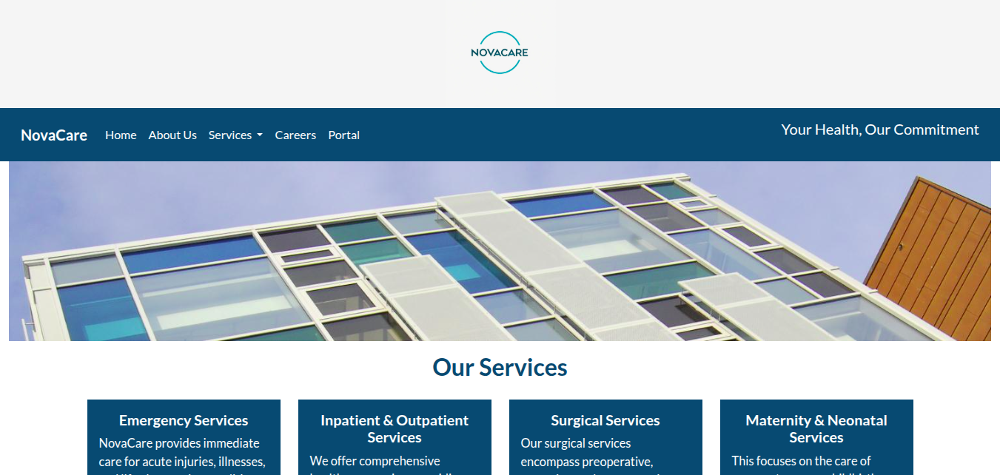
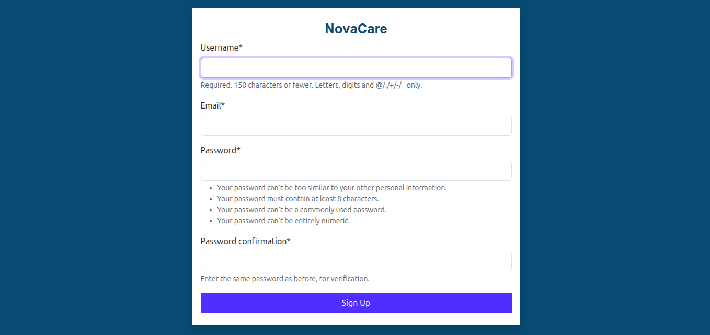

# NovaCare
A hospital management system built with Django

# Features
This project contains the following features: Home page, About page, Services page, 
User management section, Appointment page and Careers page.

# Tech Stack
The following languages are used in this project: JavaScript, CSS, HTML & Python(Django)

# Project Screenshots

  

  

  

### NB: ANY CONTRIBUTIONS TO THIS PROJECT ARE WARMLY WELCOMED.

